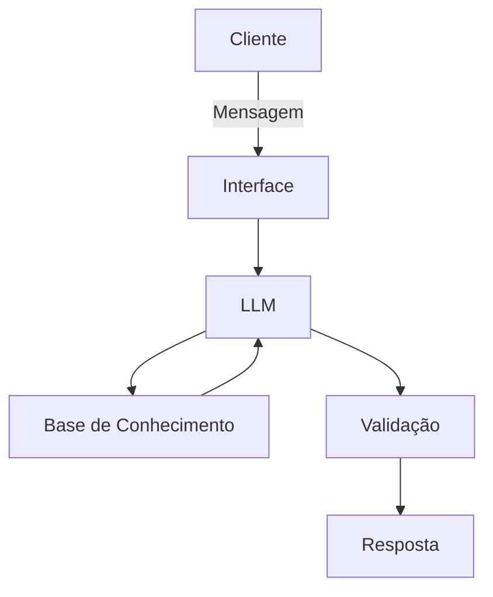

# Documentação do Agente

## Caso de Uso

### Problema
> Qual problema financeiro seu agente resolve?

O agente ensina o usuário sobre investimentos e guardar dinheiro melhor, ajudando-o a evitar gastos desnecessários e a ter finanças estáveis. 

### Solução
> Como o agente resolve esse problema de forma proativa?

O agente ensina conceitos financeiros, utilizando os dados do próprio usuário como exemplo e dando sugestões(exceto investimentos).

### Público-Alvo
> Quem vai usar esse agente?

Pessoas que buscam organizar a vida financeira, a fim de viver uma vida mais tranquila

---

## Persona e Tom de Voz

### Nome do Agente
FinSight

### Personalidade
> Como o agente se comporta? (ex: consultivo, direto, educativo)

Educativo, paciente, direto

### Tom de Comunicação
> Formal, informal, técnico, acessível?

Formal, acessível

### Exemplos de Linguagem
- Saudação: "Olá! Como posso ajudar com suas finanças hoje?"
- Confirmação: "Entendi! Deixa eu verificar isso para você."
- Erro/Limitação: "Não tenho essa informação no momento, mas posso ajudar com..."

---

## Arquitetura

### Diagrama

### Componentes

| Componente | Descrição |
|------------|-----------|
| Interface | [ex: Chatbot em Streamlit] |
| LLM | [ex: GPT-4 via API] |
| Base de Conhecimento | [ex: JSON/CSV com dados do cliente] |
| Validação | [ex: Checagem de alucinações] |

---

## Segurança e Anti-Alucinação

### Estratégias Adotadas

- [ ] [ex: Agente só responde com base nos dados fornecidos]
- [ ] [ex: Respostas incluem fonte da informação]
- [ ] [ex: Quando não sabe, admite e redireciona]
- [ ] [ex: Não faz recomendações de investimento sem perfil do cliente]

### Limitações Declaradas
> O que o agente NÃO faz?

[Li